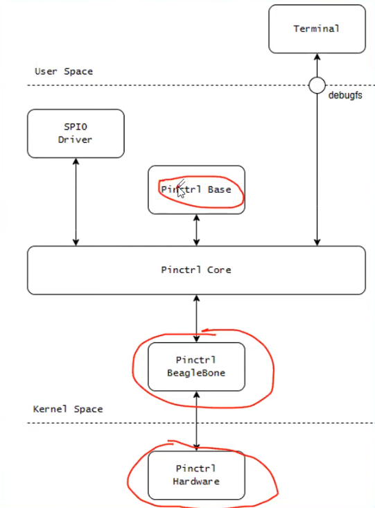
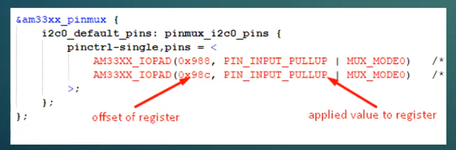
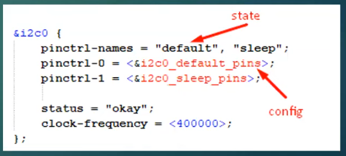

# Linux-Embedded
[1. Build Image](#1-BUILD-IMAGE)

[5. Shared Memory](#5-SHARED-MEMORY)

[7. Kernel Module](#7-KERNEL-MODULE)

[9. Character Driver](#9-CHARACTER-DEVICE-DRIVER)

[10. Device Tree](#10-DEVICE-TREE)

[13. Pin Control](#13-PIN-CONTROL)

# 1. BUILD IMAGE
## Tools chain
  Tools chain gồm các thư viện gcc, GDB, ... thư viện glibc

## uboot
  - Uboot là chương trình vđk, chạy trước hệ điều hành, làm nhiệu vụ load hệ điều hành.
  - Uboot phổ biến với kiến trúc ARM(Embedded thường chạy arm). Uboot được phát triển bởi Cty denx. Các hãng thì sẽ có các bản Patch chứa phần support cho riêng phân cứng của mình.
  - Đối với x86 là kiến trức Grub.
  - Quá trình build uboot image gcc sẽ dùng file cấu hình .config (Makefile sẽ quyết định). File .config thì được generate từ am335x_evm_defconfig.
  - Nếu muốn enable thêm 1 option nào đấy ngoài Default: make menuconfig -> enable option cần.
  - Sau quá trình biên dịch sẽ có file u-boot-dbt.img => đây chính là file uboot cần nạp vào sdcard.

## Build Kernel
```./build_kernel.sh```
Dùng để build kernel nhưng lúc chạy dòng lệnh này sẽ vừa build vừa tải về

# 5. SHARED MEMORY
## Vitrual Memory
- Trong một hệ điều hành hiện đại như Linux, nhiều chương trình (process) có thể chạy song song. Để đảm bảo mỗi tiến trình hoạt động một cách độc lập và an toàn, hệ điều hành sử dụng bộ nhớ ảo (virtual memory).

- Bộ nhớ ảo cho phép mỗi tiến trình "nhìn thấy" một không gian địa chỉ riêng biệt (virtual address space), ngay cả khi tất cả tiến trình thực sự dùng chung RAM vật lý (physical memory).

- Khi một tiến trình truy cập đến một địa chỉ ảo, hệ điều hành và phần cứng (MMU – Memory Management Unit) sẽ chuyển đổi địa chỉ ảo thành địa chỉ vật lý thông qua bảng trang (page table).

Cơ chế này giúp:

- Cô lập bộ nhớ giữa các tiến trình → tránh tình trạng tiến trình này ghi đè vùng nhớ của tiến trình khác.

- Chia sẻ tài nguyên hiệu quả thông qua các kỹ thuật như Copy-on-Write hoặc Shared Memory.

- Hỗ trợ swap (trang bộ nhớ có thể bị lưu tạm ra đĩa để giải phóng RAM).

## Shared Memory trong IPC (Inter-Process Communication)
Là một phương pháp để hai hoặc nhiều tiến trình có thể truy cập chung một vùng nhớ vật lý – giúp trao đổi dữ liệu nhanh chóng mà không cần gọi hàm kernel nhiều lần như pipe hay socket.

Các bước:
- Bước 1: Tạo file định danh

```int fd = shm_open (name, O_CREAT | O_RDWR, 0666)```


# 7. KERNEL MODULE
Các bước viết kernel module (Demo GPIO output)

Bước 1: Enalble 1 chân mà mode GPIO Output: 

`*(0x44E07000 + 0x134) |= (1 << 31)`

Bước 2: Set giá trị cho chân: 

`*(0x44E07000 + 0x194) |= (1 << 31)`

Bước 3: Clear giá trị cho chân 

Function: `ioremap()`:
- Khác với code vđk thì dùng địa chỉ vật lí trực tiếp nhưng Linux không được dùng trực tiếp mà phải thông qua Vitrual Memory.
- Phải xin cấp phát địa chỉ vật lý muốn truy cập và thao tác độc, ghi trên địa chỉ đó.

Macro: `__ioremap`
- Chỉ thị tiềnm xử lý trong C
- Báo hiệu trình biên dịch khi các câu lệnh đọc, ghi bộ với vào con trỏ iomem. Để không bị sử dụng sai mục đích.

Cùng là lập trình cho 1 chân GPIO có 2 cách
- Cách 1 thao tác trực tiếp lên thanh ghi của module GPIO.

    => Platform Driver
- Cách 2 là dùng qua API của kernel.

    => Device Driver (Khi dùng Device Driver thì bản chất là gọi Platform Driver)


# 9. CHARACTER DEVICE DRIVER
- Trong driver của các phần cứng linux thì phải tuân thủ theo đúng format quy định của HĐH.

Vì có quá nhiều device với nhiều đặc điểm khác nhau nên để quán lý được thì cần có cây phân cấp.

Cây phân cấp của OS chia ra có 3 loại ngoại vi chính:
- Character: Dữ liệu truyền là những loại ngoại vi truyền về tuần tự từng byte một (I2C, Keybroad, ...)
- Block: Dữ liệu truyền là từng block như 512 byte (Màn hình)
- Network: Dữ liệu truyền là từ ngoài hệ thống (4G, Wifi,...)

## Device file (Special file)
Mỗi character driver được ánh xạ thành một device file trong /dev/, ví dụ: /dev/mydevice

Device file là cổng giao tiếp giữa user-space và kernel-space.

## THÀNH PHẦN CỦA CHARACTER DRIVER
### 1. major number & minor number
Major: xác định driver nào xử lý device đó.

Minor: xác định thiết bị cụ thể (nếu driver quản lý nhiều thiết bị).

Đăng ký bằng register_chrdev_region() hoặc alloc_chrdev_region()

### 2. Cấu trúc file_operations
Đây là cấu trúc cực kỳ quan trọng, chứa các callback mà kernel gọi khi user-space thao tác với thiết bị:

```
struct file_operations my_fops = {
    .owner = THIS_MODULE,
    .open = my_open,
    .release = my_release,
    .read = my_read,
    .write = my_write,
    .ioctl = my_ioctl,        // (deprecated, thay bằng unlocked_ioctl)
    .unlocked_ioctl = my_ioctl,
};
```
Các hàm quan trọng:

`open(): mở thiết bị`

`read(), write(): đọc/ghi dữ liệu`

`release(): đóng thiết bị`

`ioctl(): xử lý lệnh điều khiển đặc biệt`

## QUY TRÌNH XÂY DỰNG MỘT CHARACTER DRIVER CƠ BẢN
Khởi tạo module:

```
int init_module(void) {
    alloc_chrdev_region(&dev, 0, 1, "mychardev");
    cdev_init(&my_cdev, &my_fops);
    cdev_add(&my_cdev, dev, 1);
}
```

Cleanup module:

```
void cleanup_module(void) {
    cdev_del(&my_cdev);
    unregister_chrdev_region(dev, 1);
}
````

## dump_stack() 
Hàm này cho phép dump tất cả các hàm được gọi.


# 10. DEVICE TREE

Trong hệ thống Embedded Linux, Device Tree (DT) là một cơ chế dùng để mô tả phần cứng cho kernel, giúp tách rời phần mô tả phần cứng khỏi mã nguồn của kernel. Đây là một phần rất quan trọng trong việc port Linux kernel sang các nền tảng nhúng (ARM, RISC-V, v.v.).

Linux không biết được phần cứng là gì mà chỉ biết thông qua Device tree


## Tại sao cần Device Tree?
Trên các hệ thống như x86, phần cứng được phát hiện động (dynamic discovery) thông qua BIOS/UEFI hoặc ACPI. Nhưng trên hệ thống nhúng (như ARM), phần cứng không thể tự mô tả → kernel cần một bản "bản đồ phần cứng" → chính là Device Tree.

## Thành phần chính của Device Tree
### 1. DTS (Device Tree Source)
Là file nguồn, dễ đọc.

Phần mở rộng: .dts hoặc .dtsi

### 2. DTB (Device Tree Blob)
Là file nhị phân đã biên dịch từ .dts.

Kernel sẽ load file .dtb trong lúc khởi động (boot time).

Có 2 dạng file.
`dtsi:` mô tả general về chip
`dts:` mô tả specific trên board

## Template và Infomation của Device Tree

### Ví dụ đơn giản về Device Tree

```
arch/arm/boot/dts/
├── imx6ull.dtsi           ← cấu hình SoC chung (CPU, bus, clocks...)
├── imx6ull-14x14-evk.dts  ← board cụ thể (EVK của NXP)
└── imx6ul-pinfunc.h       ← khai báo pinmux
```

Trong `imx6ull-14x14-evk.dts:`

```dts
#include "imx6ull.dtsi"     // Kế thừa cấu hình SoC cơ bản

/ {
    model = "NXP i.MX6ULL 14x14 EVK Board";
    compatible = "fsl,imx6ull-14x14-evk", "fsl,imx6ull";

    chosen {
        bootargs = "console=ttymxc0,115200";
    };

    leds {
        compatible = "gpio-leds";
        led1 {
            gpios = <&gpio1 5 GPIO_ACTIVE_HIGH>;
            label = "user-led";
        };
    };
};
```

Trong `imx6ull.dtsi`:
```
soc {
    uart1: serial@02020000 {
        compatible = "fsl,imx6ul-uart", "fsl,imx21-uart";
        reg = <0x02020000 0x4000>;
        interrupts = <0 26 IRQ_TYPE_LEVEL_HIGH>;
        status = "disabled";
    };

    gpio1: gpio@0209c000 {
        compatible = "fsl,imx6ul-gpio", "fsl,imx35-gpio";
        reg = <0x0209c000 0x4000>;
        interrupts = <0 66 IRQ_TYPE_LEVEL_HIGH>;
        gpio-controller;
        #gpio-cells = <2>;
    };
};
```
`serial@02020000` : `serial` <Tên node> `@` `02020000`<Địa chỉ của node>  

`compatible`: Xác định driver kernel nào sẽ xử lý node này. Là chuỗi string được sử dụng maping node đó với driver điều khiển nó. 

`Address cell` (Địa chỉ bắt đầu ) & `Size cell`(Chiều dài của địa chỉ) là bộ đôi thông tin dùng để quy định fomat cho trường reg. Phần cứng có `32bit` & `64bit` mà kiểu dữ liệu để mô tả địa chỉ cho Device Tree chỉ có `4 byte`.

`reg`: địa chỉ base và kích thước vùng địa chỉ của thiết bị. 

Ví dụ: 
0x1
  32 bit 0x1
  64 bit 0x0 0x1

32 bit 
  `address-cells`= <0x1>;
  `size-cells` = <0x1>;
=> `reg` = <0x44E07000 0x1000>

64 bit 
  `address-cells`= <0x2>;
  `size-cells` = <0x2>;
=> `reg` = <0x0 0x44E07000 0x0 0x1000>

`0x44E07000` Chính là start address của GPIO 0

`interrupts`: số IRQ.

`status`: "okay" để bật thiết bị, "disabled" để tắt.

### Dịch ngược file DTB
`dtc`: Là là file dịch ngược file dtb. Dùng để kiểm tra file 

```dtc -I dtb -O dts -o output.dts input.dtb```

`-I dtb`: định dạng đầu vào là binary .dtb

`-O dts`: định dạng đầu ra là .dts (text)

`-o output.dts`: file kết quả

`input.dtb`: file nhị phân cần dịch

### Node

Node là một khối định nghĩa phần cứng cụ thể trong cấu trúc cây của Device Tree – giống như một thiết bị (device) hay thành phần phần cứng (CPU, UART, I2C, GPIO, DRAM...).

Mỗi node có thể có:

Tên node (ví dụ: `serial@02020000`)

Label (nhãn) để tham chiếu (ví dụ: `uart1`:)

Thuộc tính (properties): kiểu dữ liệu, thông số kỹ thuật.

Các node con (child nodes): ví dụ, cảm biến gắn trên I2C.


### Ghi đè file

Dùng file `dts` để ghi đè file `dtsi`. VÌ file `dts` include file `dtsi` nên include `dtsi` vào `dts` rồi viết trong file `dts` tức là ghi đè

### Mở rộng node

Một Node có thể define ở nhiều chỗ. Sau đó khi biên dịch nó sẽ gom lại với nhau. Cũng là ghi đè nhưng mà nội dung đó chưa được define.

## Các mô tả không phổ biến

Ngoài các mô tả phổ biến được định nghĩa trong specìfic còn những trường không phổ biến sẽ nằm ở KERNEL/Documantation/Devicetree/bindings

Ngoài ra có thể difine các trường bất kì nếu muốn chỉ cần tuân theo quy tắc của Device Tree.

## Cách dùng Device

`.probe`: 

Có sử dụng mapping của compatible

`Status` là `enable`

=> Prope được gọi ra. Giúp chạy.


# 13. PIN CONTROL

- Pin control là ngoại vi cho phép config chức năng cho các chân. 
- Pin control còn cho phép Switch giửa các chức năng.
- Pin control cho phép cấu hình các thông số của pin (pull-up, pull-down, mức điện áp output...).
- Tất cả các pin đều được `1 ngoại vi` pin control điều khiển.

## Pin-muxing Table

- Là table thể hiện chức năng của pin.
- Được cung cấp bởi NSX.
- Nếu không config thì mặc định sẽ là `mode 0`

## Kiến trúc Pin Control trong Linux


- `Pinctrl Harware`: Là ngoại vi pin control của BBB. 
- `Pinctrl BBB`: Là Driver để tương tác với `Pinctrl Harware` thông qua thanh ghi của nó. Và chỉ dùng riêng cho BBB thôi. Và Driver này được cung cấp bởi NSX nằm trong SDK.
- `Pinctrl Core`: là source code của Linux. Còn là core của Framewỏk và cung cấp APIs đến những components khác. 
-`Pinctrl Base`: Được dùng để cấu hình từ Device tree để đăng kí nó `Pinctrl Core`.
-`Debugfs`: Cung cấp intèace để debug đến cho User space (Kiểm tra được cấu hình đã được nhận hay chưa và có đang sử dụng trong Device tree hay không).

## Ưu điểm:

- Quản lý được các chân pin.
- Cho phép 1 chân pin chỉ được cấp hình bởi 1 Driver.
- Dễ dàng Debug trong quá trình Deverlop

## Khai báo cấu hình trong Device Tree

### Khai báo cấu hình:



- Là node con của node pin control quản lý nó.
- Được gán một label để định danh.
- Với mỗi SoC khác nhau thì việc khai báo cấu hình sẽ khác nhau.


### Khai báo chức năng:
 - Sử dụng khai báo cấu hình để apply khai báo cấu hình vào hệ thống.



- Sử  dụng 2 thuộc tính pinctrl-names và pinctrl-<id>.
- pinctrl-names sẽ là định danh cho pinctrl-id.
- pinctrl-<id> sẽ trỏ đến node cấu hình.
