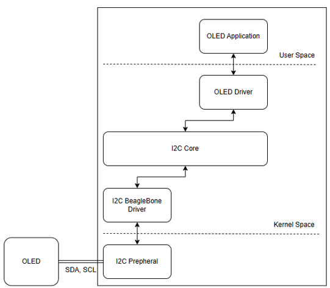

# Kiến trúc I2C Trong Linux



Trước tiên SDA và SCL phải có dữ liệu <= Ngoaị vi I2c trên BB tạo ra dữ liệu <= Được điều kiể i bởi `I2C BB Driver` (Có nhiệm vụ ghi vào những tham số tương ứng vào ngoại vi I2C) <= `I2C Core:` Là Giao tiếp giũa `I2C kernal` và `OLED Driver` <= `OLED Driver:` Xử lý logic của các tập lệnh <= `OLED application` gửi lệnh vẽ/ ghi dữ liệu lên màn hình (Là 1 app tương tác với người dùng).

## Vì sao lại có kiến trúc phức tạp

Giải quyết được vấn đề khi có nhiêù Board khác nhau. BBB, Pi, Jetson. Chỉ cần giao tiếp với nhau.

# Khởi tạo OLED trong DT

- Khởi tạo trong file `am335x-boneblack.dts`. Đây chính là file DT của broad. Không được khởi tạo trong file `dtsi` vì đây là file chung.
- Lúc này giống như là ghi đè file trước đó đã nhắc tới.

Ví dụ về ghi đè trong file `am335x-boneblack.dts`:

``` dts
&i2c0 {
    status = "okay";
    lcd_oled:ssd1306@27{
        compatible = "ssd1306";
        reg = <0x27>;
        status = "okay";
    } 
}
```

- rebuld lại `DT`

- Nạp lại `DT`
1. Copy file `dtb` sang BBB
2. Check SUM file trước.
`md5sum am335x-boneblack.dtb `
3. Coppy vào kernel. 
`cp -vf am335x-boneblack.dtb /boot/dtbs/5.4.288-bone69/am335x-boneblack.dtb`
4. Check SUM lại file trong kernel. 
`md5sum /boot/dtbs/5.4.288-bone69/am335x-boneblack.dtb`
5. Reboot.
6. Check lại trong `/sys/class/i2c-adapter/` đã có node thêm vào chưa? (Kiểm tra địa chỉ).


# Giải thích code Porting 

- Lưu ý nhớ export toolschain trước khi muốn build lại kernel. 
`export PATH=$PATH:/mnt/D4D2E800D2E7E4A8/linuxCompoment/BBB/src/gcc-11.3.0-nolibc/arm-linux-gnueabi/bin`

### 1. Khai báo cấu trúc I2C Driver
```c
static struct i2c_driver ssd1306_i2c_driver = {
	.driver = {
		.name = "ssd1306",
		.owner = THIS_MODULE,
	},
	.probe = ssd1306_i2c_probe,
	.remove = ssd1306_i2c_remove,
	.id_table = ssd1306_i2c_match_id,
};

```
### 2. Khai báo hàm probe
```C
static int ssd1306_i2c_probe(struct i2c_client *client, const struct i2c_device_id *id) 
{
	struct ssd1306_i2c_module *module;

	module = kmalloc(sizeof(*module), GFP_KERNEL);
	if (!module) {
		pr_err("kmalloc failed\n");
		return -1;
	}

	module->client = client;
	module->line_num = 0;
	module->cursor_position = 0;
	module->font_size = SSD1306_DEF_FONT_SIZE;
	i2c_set_clientdata(client, module);

	ssd1306_display_init(module);
	ssd1306_set_cursor(module, 0, 0);
	ssd1306_print_string(module, "Hello\nWorld\n");
	pr_info("Sheldon: %s, %d\n", __func__, __LINE__);
	return 0;
}

```

### 3. Khai báo hàm remove
``` c
static int ssd1306_i2c_remove(struct i2c_client *client)
{
	struct ssd1306_i2c_module *module = i2c_get_clientdata(client);

	ssd1306_print_string(module, "End!!!");
	msleep(1000);
	ssd1306_clear(module);
	ssd1306_write(module, true, 0xAE); // Entire Display OFF

	kfree(module);
	pr_info("Sheldon: %s, %d\n", __func__, __LINE__);
	return 0;
}
```

### 4. Khai báo cấu trúc of_device_ID cho matching với node DT 
```c
static const struct i2c_device_id ssd1306_i2c_match_id[] = {
	{ "ssd1306", 0 },
	{ }
};
```

### 5. Đăng kí để tự động insmod vào kernel nếu trùng.
```c
MODULE_DEVICE_TABLE(i2c, ssd1306_i2c_match_id);
```
### 6. Hỗ trợ Device Tree (of_device_id)
```c
static const struct of_device_id ssd1306_of_match[] = {
    { .compatible = "ssd1306" },
    { }
};
MODULE_DEVICE_TABLE(of, ssd1306_of_match);
```
Thêm vào struct driver:
```c
.driver = {
    .name = "ssd1306",
    .owner = THIS_MODULE,
    .of_match_table = ssd1306_of_match, // Hỗ trợ Device Tree
},
```

### 7. Đăng ký driver với kernel (module_i2c_driver)
```c
module_i2c_driver(ssd1306_i2c_driver);
```
Macro này sẽ tự động tạo hàm init/exit cho driver.

### 8. Cấu trúc dữ liệu module
```c
struct ssd1306_i2c_module {
    struct i2c_client *client;
    uint8_t line_num;
    uint8_t cursor_position;
    uint8_t font_size;
};
```

### 9. Hàm giao tiếp I2C cơ bản
```c
static int ssd1306_i2c_write(struct ssd1306_i2c_module *module, unsigned char *buf, unsigned int len) {
    return i2c_master_send(module->client, buf, len);
}
```

### 10. Một số best practices:
- Sử dụng `devm_kzalloc` thay cho `kmalloc` để tự động giải phóng bộ nhớ khi remove driver.
- Sử dụng `dev_err`, `dev_info` thay cho `pr_err`, `pr_info` để log kèm context thiết bị.
- Luôn kiểm tra lỗi khi giao tiếp I2C và trả về mã lỗi phù hợp.
- Thêm license, author, description cho module:
```c
MODULE_LICENSE("GPL");
MODULE_AUTHOR("Sheldon <hung19092003@gmail.com>");
MODULE_DESCRIPTION("SSD1306 OLED I2C Driver");
```

### 11. Quy trình hoạt động tổng quát của I2C driver:
1. Khai báo struct driver, id_table, of_match_table
2. Đăng ký driver với kernel
3. Khi kernel phát hiện thiết bị phù hợp, hàm probe được gọi
4. Trong probe: khởi tạo thiết bị, lưu context, khởi tạo màn hình
5. Khi remove: giải phóng tài nguyên, tắt màn hình

### 12. Tài liệu tham khảo:
- [Linux I2C Subsystem Documentation](https://www.kernel.org/doc/html/latest/i2c/index.html)
- [Linux Device Drivers, 3rd Edition](https://lwn.net/Kernel/LDD3/)